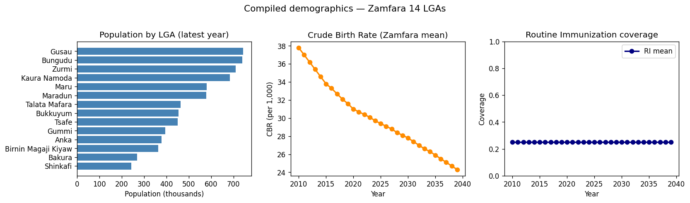
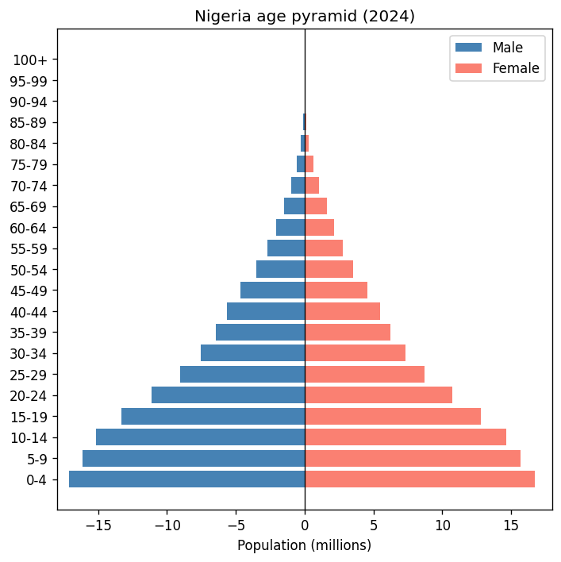
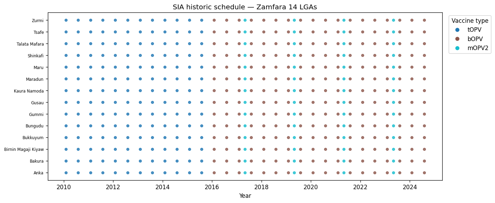
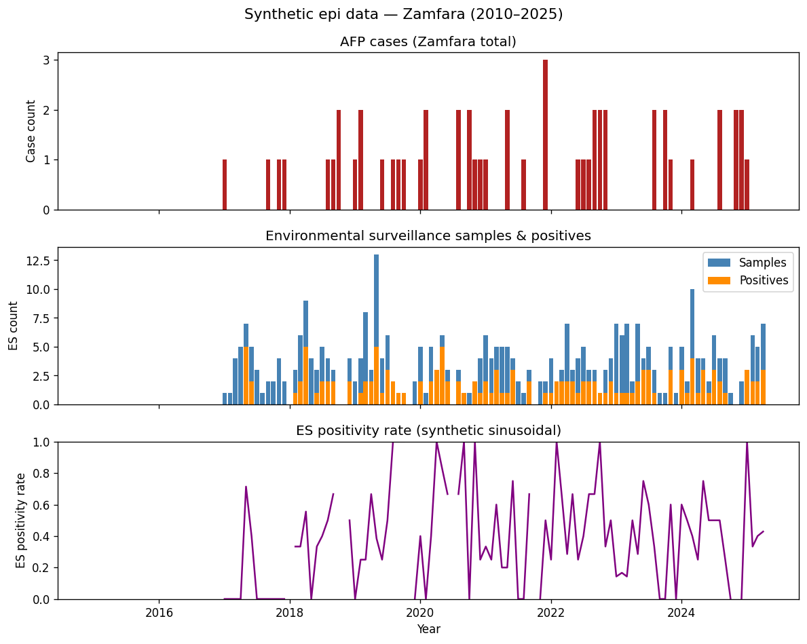
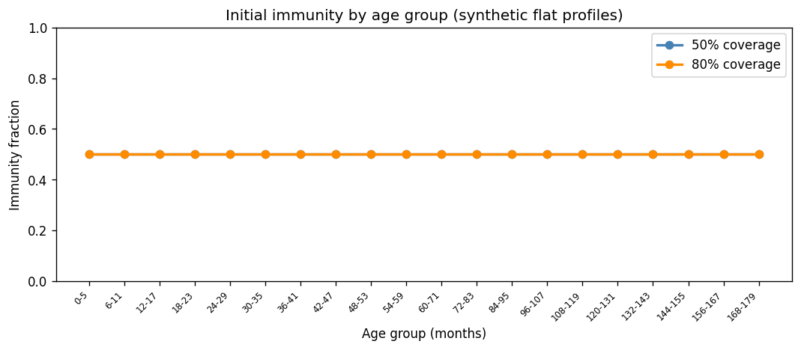
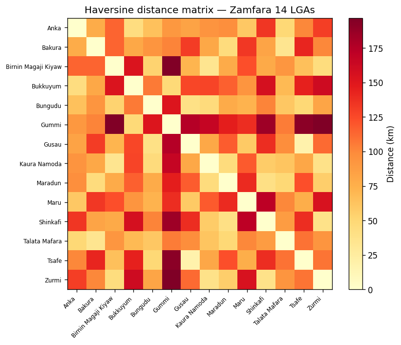

# laser-polio-zamfara-data

Minimal public Zamfara test dataset for [laser-polio](https://github.com/InstituteforDiseaseModeling/laser-polio).

Contains synthetic/public data for the 14 LGAs of Zamfara State, Nigeria — safe for open distribution. Sensitive partner-derived values have been replaced with representative synthetic values.

## Install

```bash
pip install laser-polio-zamfara-data
```

## Usage

Extract the bundled data to a local directory and generate a `manifest.py`:

```bash
python -m laser_polio_zamfara --target ~/my_laser_data
```

Then point laser-polio at it:

```bash
export LASER_POLIO_DATA=~/my_laser_data
```

Or in Python:

```python
import os
os.environ["LASER_POLIO_DATA"] = "/path/to/my_laser_data"

from laser_polio.manifest_loader import load_manifest
manifest = load_manifest()
print(manifest.population)   # Path to compiled CSV
print(manifest.node_lookup)  # Path to node_lookup.json
```

### Automatic bootstrap (pytest)

If `laser-polio-zamfara-data` is installed, `laser-polio`'s `conftest.py` will
auto-bootstrap a temporary data directory before any tests run — no manual setup
needed:

```bash
pip install laser-polio-zamfara-data
pytest tests/
```

## Files included

| File | Description |
|---|---|
| `compiled_cbr_pop_ri_sia_underwt_africa.csv` | Population, CBR, RI — Zamfara rows; sensitive columns zero-filled for `reff_random_effect` / `sia_random_effect` |
| `node_lookup.json` | Lat/lon centroids for 14 Zamfara LGAs (public) |
| `shp_africa_low_res.gpkg` | Shapefile subset for Zamfara (public) |
| `Nigeria_age_pyramid_2024.csv` | UN/WorldPop age pyramid (public) |
| `cbr_NGA.json` | Crude birth rate for Zamfara state |
| `distance_matrix_africa_adm2.h5` | Haversine distance matrix computed from node_lookup |
| `sia_historic_schedule.csv` | Synthetic SIA schedule (structurally plausible) |
| `sia_scenario_1.csv` | Synthetic future SIA schedule |
| `epi_africa_20250408.h5` | Synthetic epi data — sinusoidal AFP cases and environmental surveillance |
| `epi_africa_20250421.h5` | Alias of above (same format, independent draw) |
| `init_immunity_0.5coverage_january.h5` | Synthetic flat immunity (50%) |
| `init_immunity_0.8coverage_january.h5` | Synthetic flat immunity (80%) |
| `regions.yaml` | Region grouping (Zamfara → Northwest) |
| `adm01_adjacency.npz` | Adm01 adjacency for Zamfara (self-adjacent) |

## Data visualizations

### Population, CBR, and routine immunization



Population by LGA (most recent year), crude birth rate trend, and routine immunization coverage.
Note: `reff_random_effect` and `sia_random_effect` columns are zero-filled placeholders.

### Age pyramid



Nigeria national age pyramid (2024), from UN/WorldPop public data.

### SIA historic schedule



Synthetic supplementary immunization activity (SIA) schedule for Zamfara's 14 LGAs, 2010–2025.
Each dot is one SIA campaign; colors indicate vaccine type.

### Synthetic epi data



Synthetic AFP case counts, environmental surveillance (ES) samples and positives, and ES
positivity rate. Generated from a hand-tuned annual sinusoidal model — **not derived from
partner data**. Zero before 2017; Poisson/Binomial draws thereafter.

### Initial immunity age profiles



Flat synthetic immunity profiles at 50% and 80% coverage, constant across all age groups
and Zamfara LGAs.

### Distance matrix



Haversine distances (km) between LGA centroids, computed from the public `node_lookup.json`.

## Regenerating plots

```bash
python docs/generate_readme_plots.py
```

## Regenerating from private data

```bash
python scripts/make_zamfara_test_data.py --output /path/to/output
```

This script lives in the main `laser-polio` repo and requires access to the private dataset.

## License

MIT
